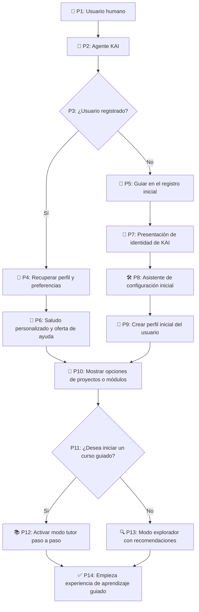

# 🤝 Flujo de interacción inicial con el Agente KAI

Este documento describe cómo se establece la primera conexión entre un usuario humano y el Agente Inteligente KAI, con énfasis en el enfoque pedagógico, personalizado y respetuoso de su diseño.

---

## 🔁 Diagrama de flujo: Usuario humano inicia interacción con KAI

---

## 🧩 Comportamiento clave del flujo:

- KAI adapta su comportamiento según el nivel de experiencia del usuario.
- Todo comienza con una **presentación clara y amigable**, siguiendo los principios de comunicación asertiva.
- Se respeta la autonomía del usuario en todo momento: **KAI no impone decisiones**.
- El flujo contempla tanto usuarios novatos como avanzados.
- Este flujo puede ser ampliado con detección de errores, ayuda interactiva, y feedback emocional si se desea.

---

## 📚 Documentos relacionados

## 📚 Documentos relacionados

| Documento              | Rol específico en el flujo                                  |
|------------------------|--------------------------------------------------------------|
| `kai_identidad.md`     | Contiene la identidad que se muestra en **P7**               |
| `kai_comunicacion.md`  | Define cómo KAI debe comportarse en **P6**, **P7** y **P10**  |
| `kai_debugging.md`     | Evalúa si el flujo general funciona correctamente hasta **P14** |
| `kai_modulos.md`       | Fuente de datos para la selección que ocurre en **P10**       |
| `kai_seguridad.md`     | Detalla la seguridad durante **P5**, **P8** y **P9**          |

---

